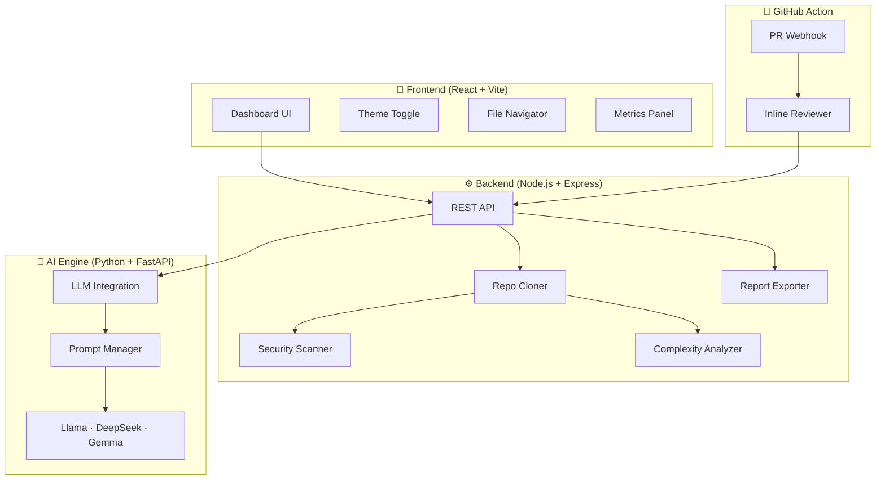

<div align="center">

# 🚀 RepoSage — AI-Powered Developer Copilot

### _Automated Code Review · Security Scanning · Documentation Generation · Repository Intelligence_

[](LICENSE)
[](https://gssoc.girlscript.tech/)
[](https://codecov.io/gh/kalyan-1845/ai-code-reviewer)
[](https://nodejs.org/)
[](https://react.dev/)
[](https://python.org/)
[](CONTRIBUTING.md)

<br/>

> **"Stop reviewing code manually. Let AI find the bugs, vulnerabilities, and improvements for you."**

Developers spend **60% of their time** reading and reviewing code. **RepoSage** automates this with AI — analyzing entire GitHub repositories for bugs, security flaws, performance bottlenecks, and generating comprehensive documentation in seconds.

<br/>

[📖 Documentation](./API.md) · [🐛 Report Bug](https://github.com/kalyan-1845/ai-code-reviewer/issues) · [💡 Request Feature](https://github.com/kalyan-1845/ai-code-reviewer/issues) · [🤝 Contribute](CONTRIBUTING.md)

</div>

---


## 📋 Table of Contents

- [✨ Features](#-features)
- [🏗️ Architecture](#️-architecture)
- [🛠️ Tech Stack](#️-tech-stack)
- [⚡ Quick Start](#-quick-start)
- [🤖 GitHub Action Integration](#-github-action-integration)
- [📊 API Reference](#-api-reference)
- [🗺️ Roadmap](#️-roadmap)
- [🤝 Contributing](#-contributing)
- [👥 Contributors](#-contributors)
- [📜 License](#-license)

---


## ✨ Features

<table>
<tr>
<td width="50%">

### 🔍 AI Code Review
Automated detection of bugs, anti-patterns, performance bottlenecks, and style violations powered by LLMs (Llama 3, DeepSeek, Google Gemma).

</td>
<td width="50%">

### 🛡️ Security Scanner
Regex-based credential detection for API keys, private keys, Twilio tokens, AWS secrets, and common `.env` file leaks.

</td>
</tr>
<tr>
<td width="50%">

### 📝 README Generator
Automatically generates comprehensive, well-structured documentation for any repository with a single click.

</td>
<td width="50%">

### 📊 Complexity Metrics
Static analysis computing Lines of Code, Comment Density, Function Counts, and Complexity Grades (A–F) per file.

</td>
</tr>
<tr>
<td width="50%">

### 🌐 13+ Languages
Full support for Python, JavaScript, TypeScript, Java, Go, Rust, C++, C#, PHP, Ruby, SQL, HTML, and CSS.

</td>
<td width="50%">

### 🎨 Modern Dashboard
Beautiful React dashboard with Light/Dark themes, file tree search, interactive metrics, and one-click HTML report export.

</td>
</tr>
<tr>
<td width="50%">

### 🤖 GitHub Action Bot
Drop-in GitHub Action that posts inline, line-by-line AI review comments directly on your Pull Requests.

</td>
<td width="50%">

### 💬 AI Repository Chat
Ask natural-language questions about any codebase — _"Explain the authentication flow"_, _"Where are the API routes?"_

</td>
</tr>
</table>

---


## 🏗️ Architecture



The project is split into **four independent modules**:

| Module | Tech | Description |
|--------|------|-------------|
| **Frontend** | React 19 + Vite + Vanilla CSS | Interactive dashboard with theme toggle, file search, and metrics visualization |
| **Backend** | Node.js 18 + Express | REST API for repo cloning, security scanning, complexity analysis, and report export |
| **AI Engine** | Python 3.10 + FastAPI | LLM-powered code review, bug detection, and README generation |
| **GitHub Action** | Bundled JS Runner | Automated PR review bot posting inline comments on GitHub |

---


## 🛠️ Tech Stack

<div align="center">

| Layer | Technologies |
|:------|:-------------|
| **Frontend** |     |
| **Backend** |    |
| **AI Engine** |    |
| **AI Models** |    |
| **DevOps** |   |

</div>

---


## ⚡ Quick Start

### Prerequisites

- **Node.js** ≥ 18 & **npm** ≥ 9
- **Python** ≥ 3.10 & **pip**
- **Git**
- A free **[Groq API Key](https://console.groq.com/keys)**

### Getting Your GROQ API Key

1. Go to **[console.groq.com/keys](https://console.groq.com/keys)** and sign in (or create a free account).
2. Click **Create API Key**, give it a name (e.g., `reposage`), and copy the key.
3. The key is used by the **Backend** and **AI Engine** via `GROQ_API_KEY` env var. See the backend setup below.

### 1. Clone the Repository

```bash
git clone https://github.com/kalyan-1845/ai-code-reviewer.git
cd ai-code-reviewer
```

### 2. Backend Setup

```bash
cd backend
npm install
cp .env.example .env    # Add your GROQ_API_KEY
npm run dev              # Starts on http://localhost:5000
```

### 3. AI Engine Setup

```bash
cd ai-engine
pip install -r requirements.txt
uvicorn app:app --reload  # Starts on http://localhost:8000
```

### 4. Frontend Setup

First, navigate to the frontend directory:
```bash
cd frontend
```

Install the dependencies:
```bash
npm install
```

**Configure Environment Variables:**
You need to provide your Groq API key for the frontend to function. Copy the example environment file and add your key:
```bash
cp .env.example .env
```
*(Open the newly created `.env` file and set `GROQ_API_KEY=your_api_key_here`)*

Finally, start the development server:

```bash
npm run dev
```
> 💡 **Tip**: Open `http://localhost:3000` in your browser, paste any public GitHub repo URL, and click **Analyze** to see RepoSage in action!

---


## 🤖 GitHub Action Integration

Add automated AI code review to **any repository** in 2 minutes:

```yaml
# .github/workflows/reposage-review.yml
name: RepoSage AI Reviewer
on:
  pull_request:
    types: [opened, synchronize]

jobs:
  review:
    runs-on: ubuntu-latest
    permissions:
      pull-requests: write
    steps:
      - name: Checkout Code
        uses: actions/checkout@v4
      - name: Run RepoSage AI PR Audit
        uses: kalyan-1845/ai-code-reviewer/github-action@main
        with:
          github-token: ${{ secrets.GITHUB_TOKEN }}
          groq-api-key: ${{ secrets.GROQ_API_KEY }}
```

The bot will automatically post inline, line-by-line review comments on every new PR!

---


## 📊 API Reference

For complete endpoint documentation with request/response examples, see **[API.md](./API.md)**.

| Endpoint | Method | Description |
|----------|--------|-------------|
| `/api/analyze` | `POST` | Analyze a GitHub repository |
| `/api/reports/html` | `POST` | Export audit report as HTML |
| `/api/chat` | `POST` | Chat with a repository using AI |
| `/analyze` | `POST` | AI Engine direct analysis (FastAPI) |

---


## 🗺️ Roadmap

See our full **[ROADMAP.md](./ROADMAP.md)** for the detailed project roadmap.

| Phase | Status | Highlights |
|-------|--------|------------|
| **Phase 1**: MVP | ✅ Complete | Repo import, AI review, README generation, Dashboard UI |
| **Phase 2**: Core Enhancements | ✅ Complete | 13+ languages, report export, security scanner, model selection |
| **Phase 3**: Advanced Features | ✅ Complete | AI repo chat, architecture diagrams, PR bot, complexity metrics |
| **Phase 4**: Community & Scale | 🚧 In Progress | Audit history, PDF export, settings modal, composition charts |
| **Phase 5**: GSSoC Epics | 🚀 Active | **VS Code Extension**, **AI RAG Vector System**, **Analytics Dashboard** |

---

## 🌟 Active GSSoC '26 Epics

We have recently opened **45 new granular issues** across 3 massive architectural epics for our GSSoC contributors! 

1. **🔌 Native VS Code Extension:** Bring RepoSage directly into the developer's IDE.
2. **🧠 AI RAG System (Vector DB):** Upgrade our chat feature with ChromaDB to query entire repositories using embeddings.
3. **📊 Multi-Repo Analytics Dashboard:** Build an enterprise-grade tracking dashboard for engineering managers.

Want to help us build these? Jump into our [Issues tab](https://github.com/kalyan-1845/ai-code-reviewer/issues) and filter by the `epic` or `gssoc` labels!

---


## 🤝 Contributing

We are proudly part of **[GirlScript Summer of Code (GSSoC) '26](https://gssoc.girlscript.tech/)**! 🎉

We welcome contributions from everyone — whether you're a first-time open-source contributor or a seasoned developer.

### How to Get Started


1. 📖 Read our **[Contributing Guidelines](CONTRIBUTING.md)**
2. 🏷️ Browse **[Good First Issues](GOOD_FIRST_ISSUES.md)** for beginner-friendly tasks
3. 💬 Comment on an issue to get assigned
4. 🍴 Fork, code, and submit a PR!

> **Note**: Please wait for an admin/mentor to assign the issue before starting work to avoid duplicate efforts.

---


## 👥 Contributors

Thanks to all the amazing people who have contributed to RepoSage! 💙

<a href="https://github.com/kalyan-1845/ai-code-reviewer/graphs/contributors">
  
</a>

---


## ⭐ Support the Project

If you find RepoSage useful, please consider giving it a ⭐ on GitHub — it helps the project grow and motivates us to keep improving!

<div align="center">

[](https://github.com/kalyan-1845/ai-code-reviewer)
[](https://github.com/kalyan-1845/ai-code-reviewer/fork)
[](https://github.com/kalyan-1845/ai-code-reviewer)

</div>

---


## 📜 License

This project is licensed under the **MIT License** — see the [LICENSE](LICENSE) file for details.

---


<div align="center">

**Built with ❤️ by [Bhoompally Kalyan Reddy](https://github.com/kalyan-1845) and the open-source community.**

_RepoSage — Making code review smarter, one repository at a time._

</div>
